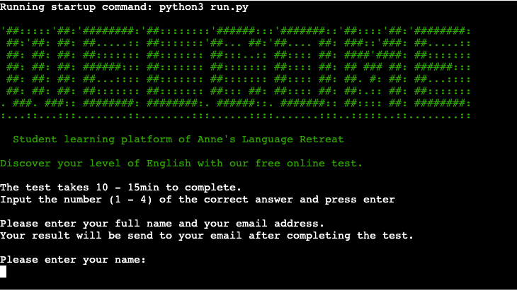
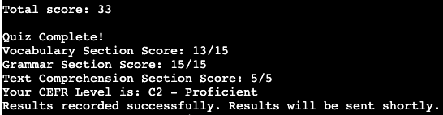
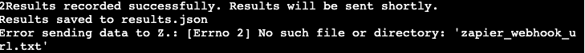

# English Level Assessment Quiz

## Table of Content

- [About the project](#about-the-project)
- [Features](#features)
  - [Existing Features](#existing-features)
  - [Features left to implement](#features-left-to-implement)
- [Testing](#testing)
  - [Initial Checks](#initial-checks)
  - [Bugs](#bugs)
  - [Remaining Bugs](#remaining-bugs)
  - [Validator Testing](#validator-testing)
-  [Deployment](#deployment)
-  [Usage](#usage)
-  [Contribution](#contribution)
- [Acknowledgement](#acknowledgement)
  - [Content](#content)
  - [Media](#media)
- [Author](#author)
- [License](#license)

## Overview
This Python application assesses a student's English level based on vocabulary, grammar, and text comprehension. Results are recorded in Google Sheets, saved to a JSON file  and then exported to Zapier to automatically send an email to the student with their results.
The application is part of a learning platform from a Homestay Host & English Tutor who uses the results for developping an individual course plan for each student to address their needs in the most efficient way.
The error handling is robust and user-friendly, accounting for common errors caused by user action such as out of the bound or incorrect character input as well as for system issues, e.g. data not correctly pulled or pushed from and to external sheets or data not transmitted correctly to trigger the automated email to the user after completing the test.

A live version of my project:

## Quiz structure

The quiz consists of three sections:

    Vocabulary Section (15 questions)
        - The questions test synonyms, antonyms, and general vocabulary knowledge.
        - Example: "What is the synonym of 'happy'?" sad -  joyful - angry - tired

    Grammar Section (15 questions)
        - The questions test the understanding of tenses, word order, modal verbs, adjectives vs. adverbs, comparatives, and pronouns.
        - Example: "Which sentence uses the modal verb correctly?" He ran quick. - He ran quickly. - He ran more quick. - He ran the most quick.

    Text Comprehension Section (1 passage with 5 questions)
        - The question test comprehension of a text about global warming from National Geographic Education
        - Example: "What is global warming, and what has caused its significant increase in the past hundred years?"

## Scoring

    Vocabulary Section: Each correct answer scores 1 point (maximum 15 points).
    Grammar Section: Each correct answer scores 1 point (maximum 15 points).
    Text Comprehension Section: Each correct answer scores 4 points (maximum 20 points).

## CEFR Levels

    The total score determines the user's CEFR level:

        A1 - Beginner: 0-10 points
        A2 - Elementary: 11-20 points
        B1 - Lower Intermediate: 21-30 points
        B2 - Upper Intermediate: 31-40 points
        C1 - Advanced: 41-45 points
        C2 - Proficient: 46-50 points

## How the English Level Assessment Quiz works

    1. The user starts the quiz by clicking "RUN PROGRAM"

    2. The command interface greets the user with a welcome message and a short information about the assessment quiz, how to answer the questions and an information that they will receive an email with the results after completing the quiz.

    3. Then the user is prompted to enter their name and email address. 

    4. The next step is to answer a sample question which demonstrates to the user that they need to input the number (1-4) corresponding to the answer option chosen. 

    5. The test loads and the user is presented the first question. There are 4 options given to answer the question with one option being correct.
        A new question is displyed after the user has answered the previous one.
       'Current score' displays the score achieved up to this point to the user.

    6. When the user has completed the quiz they receive a message "Quiz complete!", their scores, sorted by category, and their overall CEFR.

    7. Again the user is informed that they will also receive their results via email. The email will be sent automatically after a few minutes through a ZAP.

## Features

### Existing Features

### Import questions from Google Sheets

    The application requires 4 worksheets:

        - Vocabulary sheet/Grammar Sheet
          The vocabulary sheet is structured is follows:
          - column 1: questions
          - column 2-4: answer options A-D
          - column 5: correct answer

        - Comprehension Sheet
          The comprehension sheet is structured as follows:
          - column 1: reading text
          - column 2: questions
          - cloumn 3-6: answer options A-D
          - column 7: correct answer

        - Results sheet
          The results sheet is structured as follows:
          - column 1: Name
          - column 2: Email
          - cloumn 3: Vocabulary score
          - column 4: Grammar score
          - column 5: Comprehension score
          - column 6: CEFR level

### Sample Question

    The user has to answer a sample question after entering their details. The sample question demomstrates to the user how the quiz works and the way how they have to enter their answer. The user receives immediate feedback when they enter any character other then a number.

### Administer quiz via command-line interface

    The assessment quiz runs in the Code-Institute mockup terminal in Heroku.

    The questions are staged when the assessment quiz has finished loading. The questions are displayed one question after the other, the new question only after the user has answered the previous one and hit enter.

    

### Calculate and determine CEFR level

    While the user completes the quiz the score is updated for each question answered correctly: +1 in the vocabulary and grammar section, +4 in the section for text comprehension. 
    'Current score' displays the points achieved up to this point to the user. A final interim score is calcualted and displayed to the user when a section is completed.
    Upon completing the quiz the user is presented with their final score, their score for each section and their current CEFR level.

### Record and export results

    The result gets recorded in the results_sheet and results.json

    The app then sends the results to the ZAP and the user receives an email with their results for their records and a course recommendation.

### Robust and user-friendly error handling

    The error handling is robust and user-friendly, accounting for common errors caused by user action such as out of the bound or incorrect character input as well as for system issues, e.g. data not correctly pulled or pushed from and to external sheets or data not transmitted correctly to trigger the automated email the user receives after completing the test.

#### When the user inputs their name and email address:
    The system allows a maximum of 20 characters for the name. Should the user enter more characters they will receive a message informing them that the max. length allowed is 20 characters.
    
    A feedback message is provided should the email entered not be in the correct format xxx@gmail.com

#### When the user enters any other character than a number as input to answer a question:
    Immediate feedback is provided when the user types in a letter or any other character which is not a number.

#### When a system push or pull request succeeds/fails:

### Features left to implement

    - a freestyle section to test the students writing skills
    - randomizing of the questions within the sections

## Testing

### Initial Checks

    To catch and fix potential bugs early I tested the functionality of the code thoroughly after I implmeneted a new function using print statements in the relevant places and checked the output matched the results I expected before moving on.

    I confirmed that all errors caused by user action are handeled the expected way and the corresponding feedback messages are given to the user by giving invalid inputs:

        - strings where numbers were expected
        - out of bounds inputs
        - inputs not matching the expected format
    
    I tested both, my local terminal and the Code Institute Heroku terminal.

    I reviewed my Google Sheets to ensure the input is free of typos and checked that the value for 'Correct Answer' matches the corresponding index in the Python code.

    I used the raise keyword to provoke errors to check that system related error such as data not getting pushed to the results sheet and data not getting send to the ZAP are caught and handled correctly.

### Bugs

    - When rewriting the code after deciding to use Google Sheets instead of a JSON file for a better future maintainability I ran into the issue that the score did not update although the question was answered correctly. With combination of using the raise keyword and debugging statements I was able to narrow down the problem to a value mismatch between Google Sheets and the Python code. The fucntions ask_question() and comprehension_quiz() were expecting an integer matching the user input while I had saved 'A', 'B', 'C', 'D' as value for 'Correct answer'. I fixed this by updating the value for 'Correct answer' to integers for the vocabulary and grammar sheet and implmeneting the ord() method into comprehension_quiz due to the different structure of the sheet (non-unique headings).

    - When fixing the error of the scores not updating I briefly forgot that lists are zero-indexed while the sheets in Google Sheets start with '1' which resulted in the enumeration being off for the vocab_sheet and the grammar_sheet, starting with '1.' for the question instead of '1.' for the first answer option. I fixed this by reviewing the structure of my sheets and adjusting the indices accordingly.

    - When testing the app after implementing send_to_zapier_webhook() I noticed that within the mock terminal the error message "Error sending data to Z.: No such file or directory: 'zapier_webhook_url.txt'" was printed to the terminal although the results_sheet was updated correctly and I received the results email from Zapier. After confirming the code itself to be correct using debugging statements I checked the relevant part of the code in PEP8online and located an incorrect indentation plus a trailing whitespace. Correcting these resolved the error.

### Remaining Bugs:

    There are no bugs remaining.

### Validator Testing:

    - PEP8
        - No errors were returned from PEP8online.com

## Deployment
    
This project was deployed using a mock terminal provided by Code Institute for Heroku

    Steps for deployement
    - Clone or fork the repository
    - Install required libraries: `pip install gspread google-auth`
    - Set up a Google Sheets API and update `credentials.json`
    - Create a new Heroku App
    - Set the buildpacks to Python and NodeJS in that order
    - Link the Heroku App to the repository
    - Click on DEPLOY

The live link can be found here - https://english-level-test-f602597137c6.herokuapp.com/

## Usage

Ensure you have Python installed. This application requires Python 3.6 or later.
Run the script and follow the instructions to complete the quiz. The application will guide you through a series of questions to determine your English proficiency level. Results are saved in `results.json`.
Use Google Chrome or Mozilla Firefox. The mockup terminal does not work correctly in Safari.

## Contributing

Please fork the repository and submit pull requests.

## Acknowledgement

### Content
    - The template used for building this project was provided by Code Institute on Github for student projects [p3-template](https://github.com/Code-Institute-Org/p3-template)
    - I would like to thank the Stack Overflow community for pointing me in the right direction when I ran into the scoring issue.

### Media
    - Reading text: National Geographic Education, Last Updated February 21, 2024, National Geographic Society, National Geographic Society

## Author

- [merzann](https://github.com/merzann)

## License

